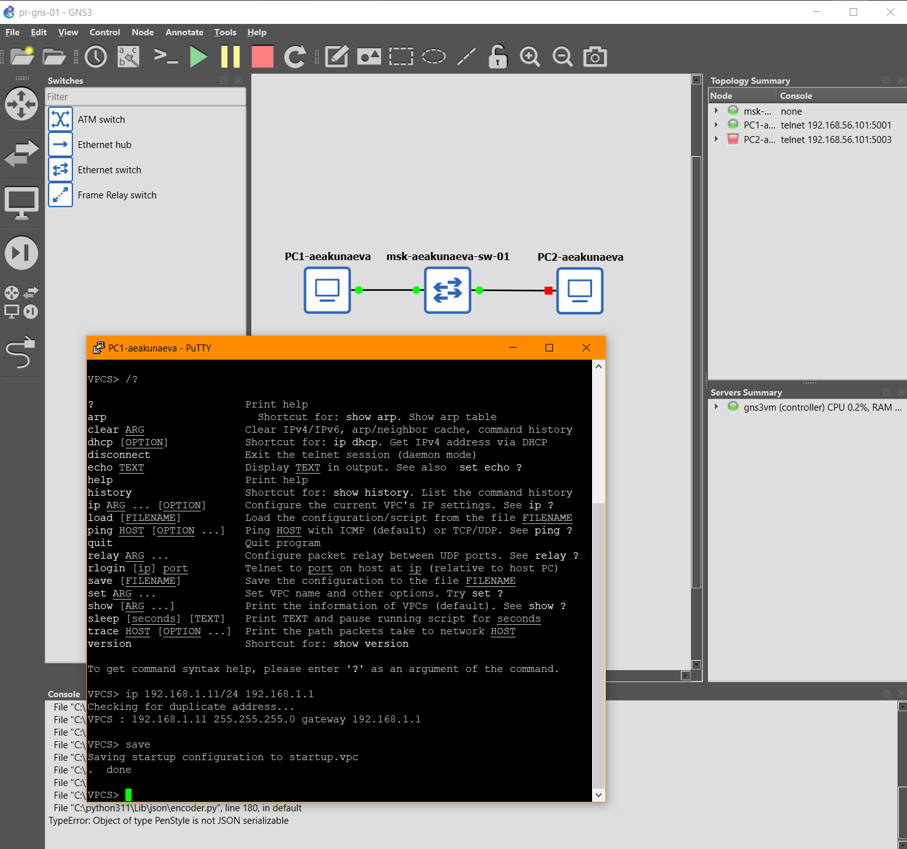
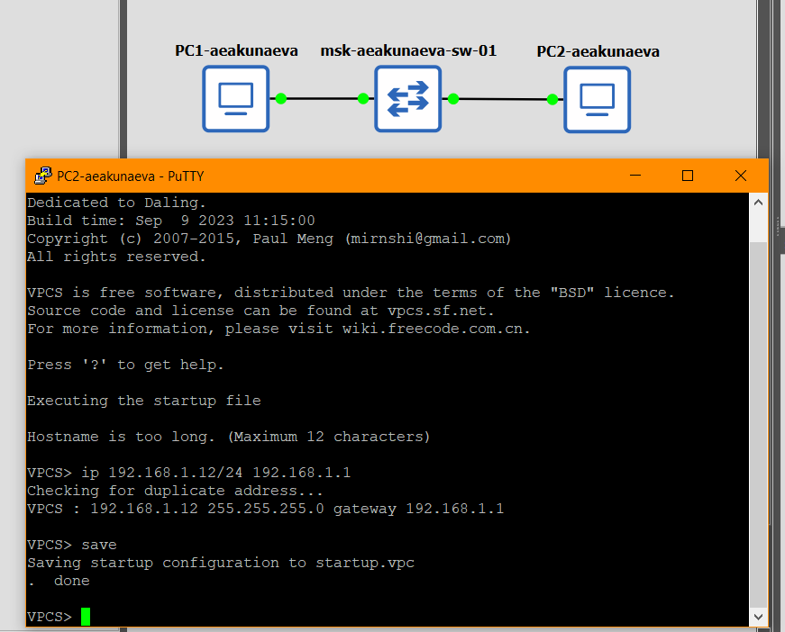
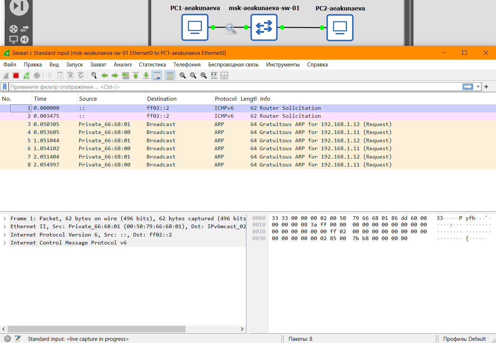
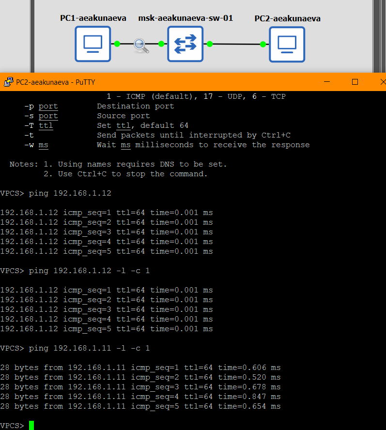
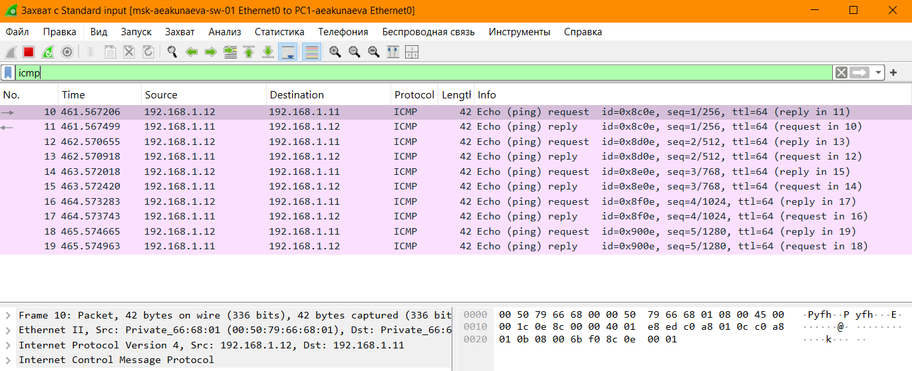
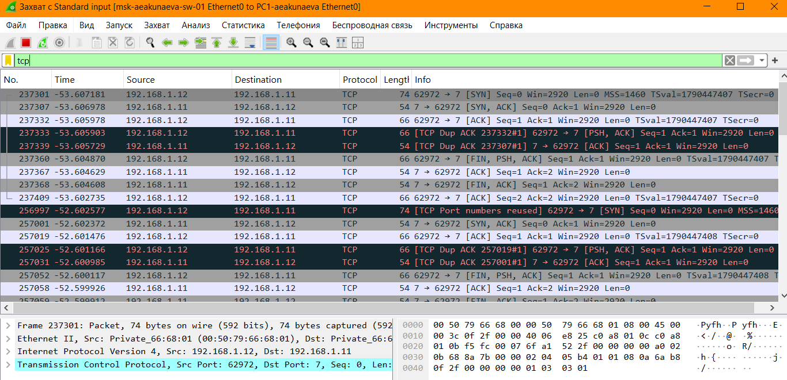
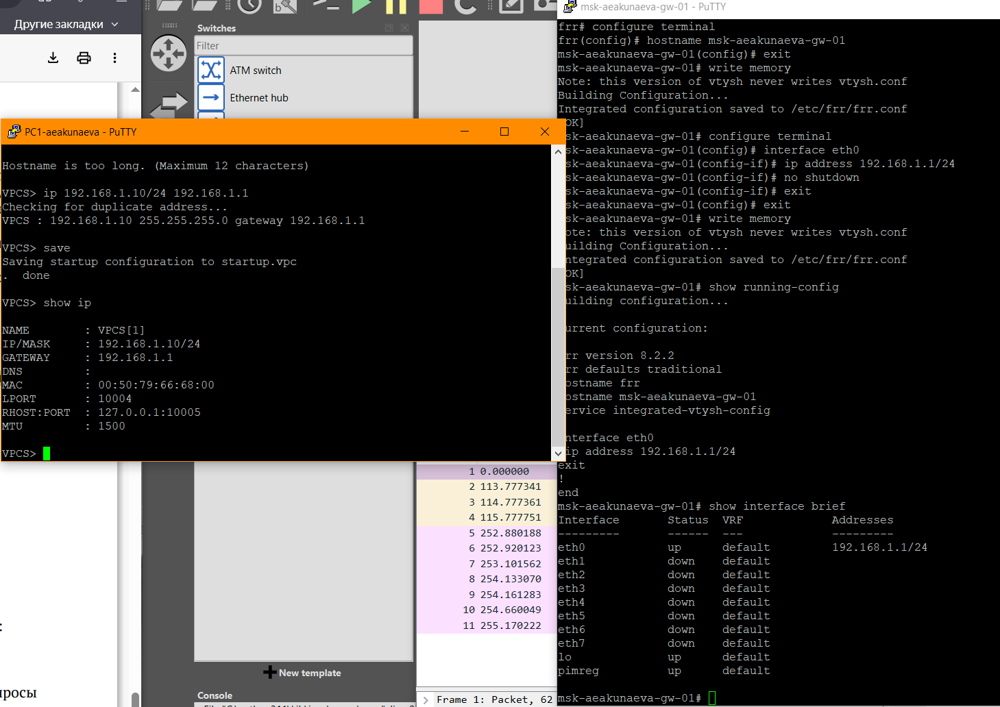
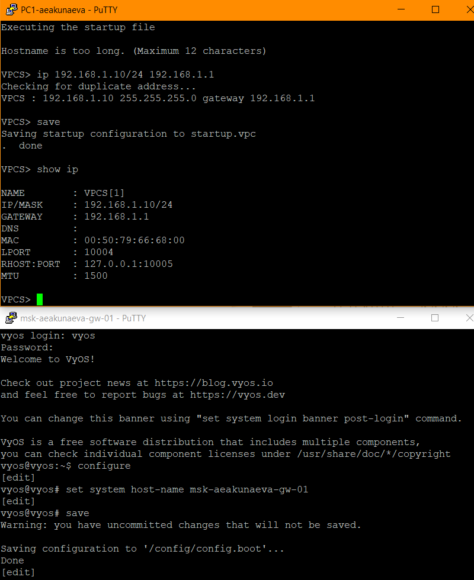

---
## Front matter
lang: ru-RU
title: Лабораторная работа №2
subtitle: Простые сети в GNS3. Анализ трафика
author:
  - Акунаева Антонина Эрдниевна
institute:
  - Российский университет дружбы народов, Москва, Россия
  
date: 2026-09-26

## i18n babel
babel-lang: russian
babel-otherlangs: english

## Formatting pdf
toc: false
toc-title: Содержание
slide_level: 2
aspectratio: 169
section-titles: true
theme: metropolis
header-includes:
 - \metroset{progressbar=frametitle,sectionpage=progressbar,numbering=fraction}
---

# Информация

## Докладчик

:::::::::::::: {.columns align=center}
::: {.column width="70%"}

  * Акунаева Антонина Эрдниевна
  * студент ФФМиЕН, НПИбд-02-24
  * Российский университет дружбы народов
  * [1032240492@rudn.ru](mailto:1032240492@rudn.ru)
  * <https://github.com/Akuxee>

:::
::: {.column width="30%"}

:::
::::::::::::::

# Цели и задачи

- Построение простейших моделей сети на базе коммутатора и маршрутизаторов FRR и VyOS в GNS3, анализ трафика посредством Wireshark.

**2.3.1. Моделирование простейшей сети на базе коммутатора в GNS3**  

1. Построить в GNS3 топологию сети, состоящей из коммутатора Ethernet и двух оконечных устройств (персональных компьютеров).  
2. Задать оконечным устройствам IP-адреса в сети 192.168.1.0/24. Проверить связь.  

**2.3.2. Анализ трафика в GNS3 посредством Wireshark**  

1. С помощью Wireshark захватить и проанализировать ARP-сообщения.  
2. С помощью Wireshark захватить и проанализировать ICMP-сообщения.  

**2.3.3. Моделирование простейшей сети на базе маршрутизатора FRR в GNS3**  

1. Построить в GNS3 топологию сети, состоящей из маршрутизатора FRR, коммутатора Ethernet и оконечного устройства.  
2. Задать оконечному устройству IP-адрес в сети 192.168.1.0/24.  
3. Присвоить интерфейсу маршрутизатора адрес 192.168.1.1/24  
4. Проверить связь.  

**2.3.4. Моделирование простейшей сети на базе маршрутизатора VyOS в GNS3**  

1. Построить в GNS3 топологию сети, состоящей из маршрутизатора VyOS, коммутатора Ethernet и оконечного устройства.  
2. Задать оконечному устройству IP-адрес в сети 192.168.1.0/24.  
3. Присвоить интерфейсу маршрутизатора адрес 192.168.1.1/24  
4. Проверить связь  

# Материалы и методы

- Linux Fedora Workstation (Markdown)
- Oracle VirtualBox 7.2.16
- GNS3 VM 3.0.6
- GNS3 3.0.6
- Wireshark

# Выполнение лабораторной работы

## Тология простейшей сети в GNS3 и задание адреса PC-1

{#fig:001 width=70%}

## Задание адреса PC-2

{#fig:002 width=70%}

## Проверка соединений

{#fig:003 width=70%}

## Анализатор трафика Wireshark

{#fig:004 width=70%}

## Отправление эхо-запросов в разных модах

{#fig:005 width=70%}

## Фильтрация пакетов по ARP-протоколу

{#fig:006 width=70%}

## Фильтрация пакетов по ICMP-протоколу

{#fig:007 width=70%}

## Фильтрация пакетов по UDP-протоколу

{#fig:008 width=70%}

## Фильтрация пакетов по TCP-протоколу

{#fig:009 width=70%}

## Проект 2 в GNS3

{#fig:010 width=70%}

## Настройка IP-адресации устройств

{#fig:011 width=70%}

## Проверка подключения соединения

{#fig:012 width=70%}

## Проект 3 в GNS3

{#fig:013 width=70%}

## Настройка устройств проекта 3

{#fig:014 width=70%}

## Проверка и сохранение изменений конфигурации маршрутизатора VyOS

{#fig:015 width=70%}

## Проверка соединения в Wireshark

{#fig:016 width=70%}

# Выводы

Я получила навыки построения простейших моделей сети на базе коммутатора и маршрутизаторов FRR и VyOS в GNS3, анализ трафика посредством Wireshark.

