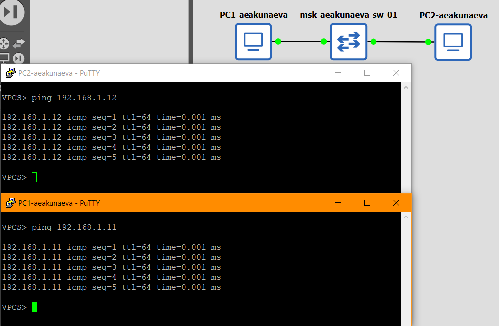
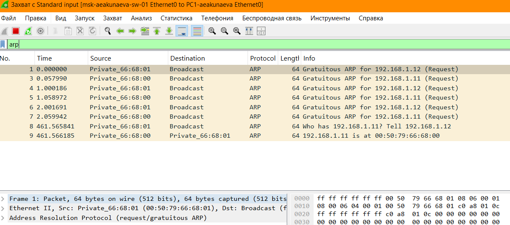
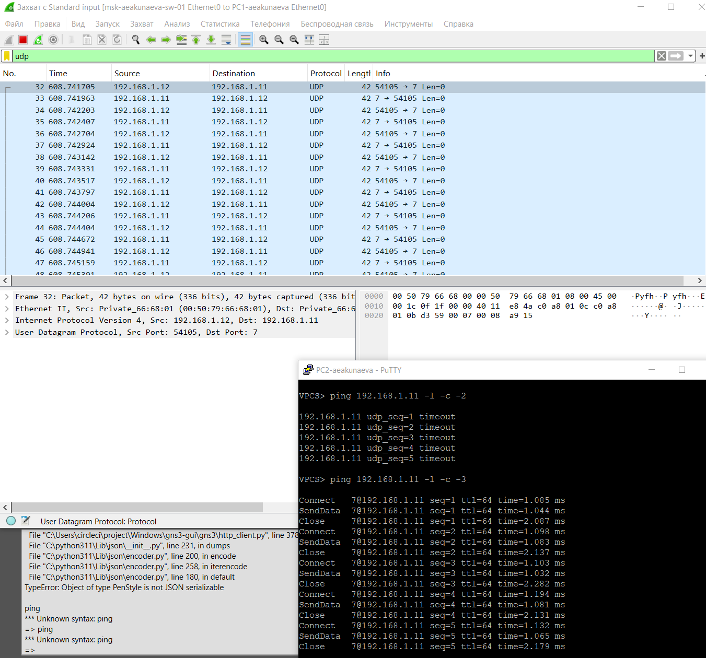
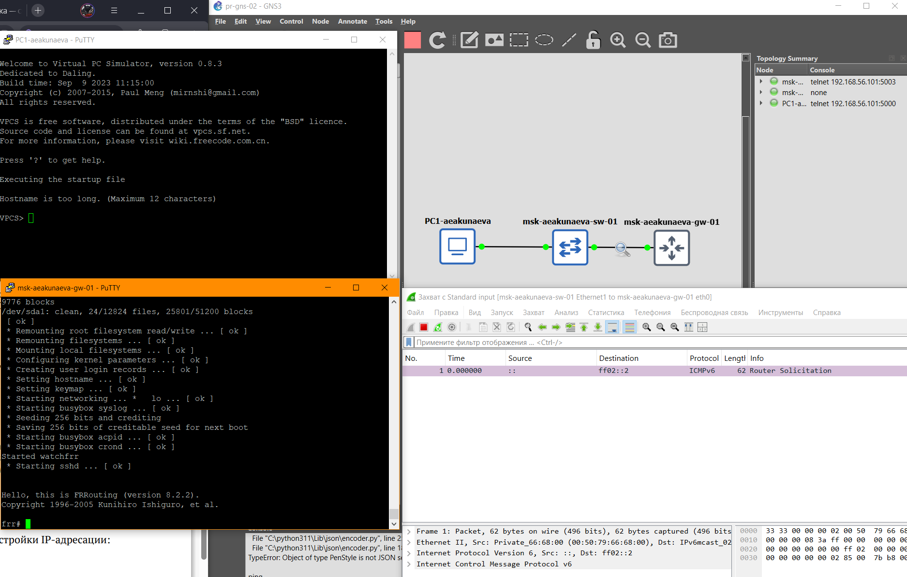
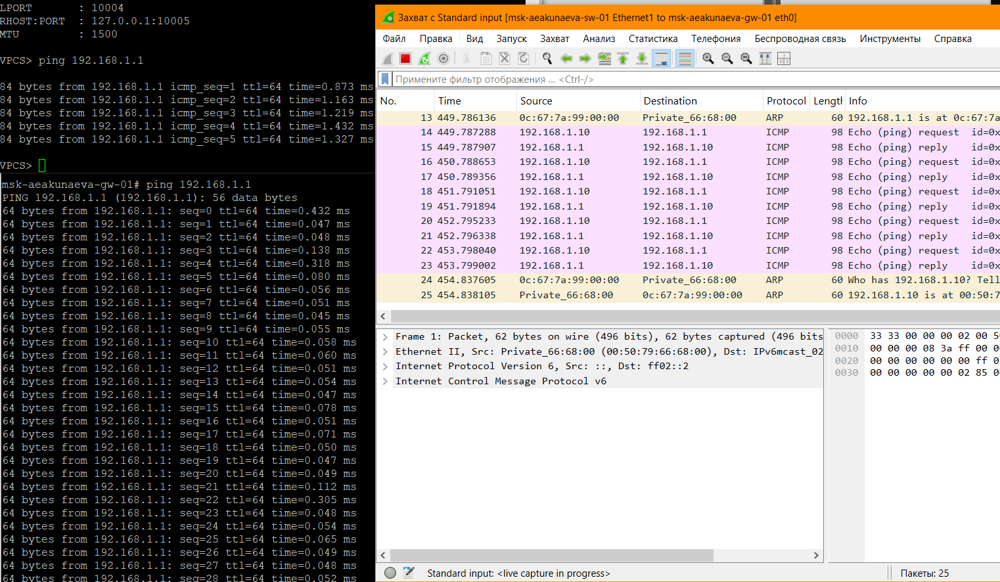
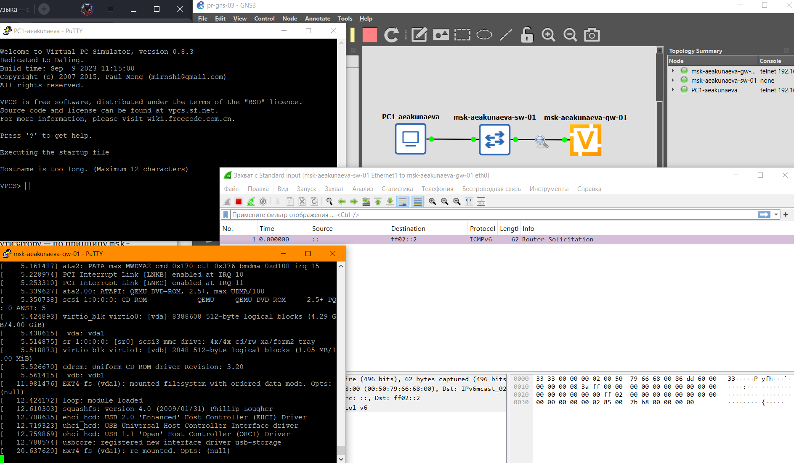
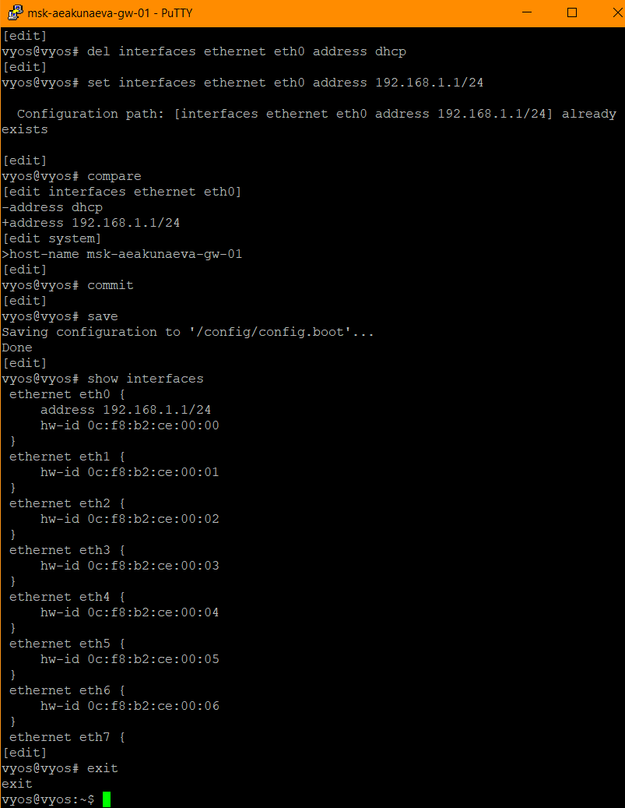
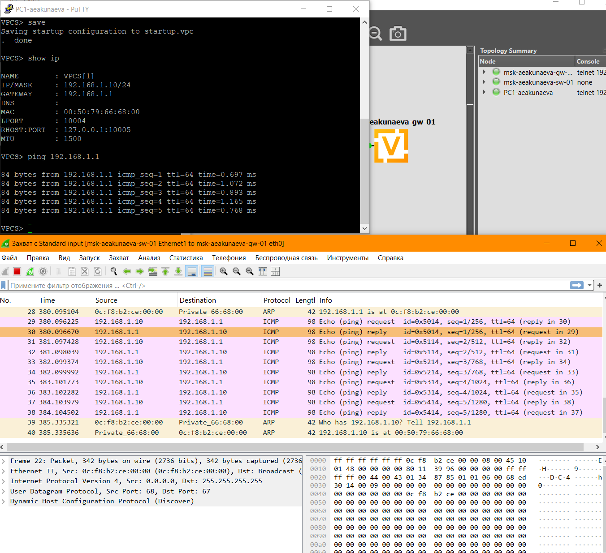

---
## Front matter
title: "Отчёт по лабораторной работе №2"
subtitle: "Простые сети в GNS3. Анализ трафика"
author: "Акунаева Антонина Эрдниевна"

## Generic otions
lang: ru-RU
toc-title: "Содержание"

## Bibliography
bibliography: bib/cite.bib
csl: pandoc/csl/gost-r-7-0-5-2008-numeric.csl

## Pdf output format
toc: true # Table of contents
toc-depth: 2
lof: true # List of figures
lot: true # List of tables
fontsize: 12pt
linestretch: 1.5
papersize: a4
documentclass: scrreprt
## I18n polyglossia
polyglossia-lang:
  name: russian
  options:
	- spelling=modern
	- babelshorthands=true
polyglossia-otherlangs:
  name: english
## I18n babel
babel-lang: russian
babel-otherlangs: english
## Fonts
mainfont: IBM Plex Serif
romanfont: IBM Plex Serif
sansfont: IBM Plex Sans
monofont: IBM Plex Mono
mathfont: STIX Two Math
mainfontoptions: Ligatures=Common,Ligatures=TeX,Scale=0.94
romanfontoptions: Ligatures=Common,Ligatures=TeX,Scale=0.94
sansfontoptions: Ligatures=Common,Ligatures=TeX,Scale=MatchLowercase,Scale=0.94
monofontoptions: Scale=MatchLowercase,Scale=0.94,FakeStretch=0.9
mathfontoptions:
## Biblatex
biblatex: true
biblio-style: "gost-numeric"
biblatexoptions:
  - parentracker=true
  - backend=biber
  - hyperref=auto
  - language=auto
  - autolang=other*
  - citestyle=gost-numeric
## Pandoc-crossref LaTeX customization
figureTitle: "Рис."
tableTitle: "Таблица"
listingTitle: "Листинг"
lofTitle: "Список иллюстраций"
lotTitle: "Список таблиц"
lolTitle: "Листинги"
## Misc options
indent: true
header-includes:
  - \usepackage{indentfirst}
  - \usepackage{float} # keep figures where there are in the text
  - \floatplacement{figure}{H} # keep figures where there are in the text
---


# Цель работы

Построение простейших моделей сети на базе коммутатора и маршрутизаторов FRR и VyOS в GNS3, анализ трафика посредством Wireshark. [@TUIS-lab]

# Задание

**2.3.1. Моделирование простейшей сети на базе коммутатора в GNS3**  

1. Построить в GNS3 топологию сети, состоящей из коммутатора Ethernet и двух оконечных устройств (персональных компьютеров).  
2. Задать оконечным устройствам IP-адреса в сети 192.168.1.0/24. Проверить связь.  

**2.3.2. Анализ трафика в GNS3 посредством Wireshark**  

1. С помощью Wireshark захватить и проанализировать ARP-сообщения.  
2. С помощью Wireshark захватить и проанализировать ICMP-сообщения.  

**2.3.3. Моделирование простейшей сети на базе маршрутизатора FRR в GNS3**  

1. Построить в GNS3 топологию сети, состоящей из маршрутизатора FRR, коммутатора Ethernet и оконечного устройства.  
2. Задать оконечному устройству IP-адрес в сети 192.168.1.0/24.  
3. Присвоить интерфейсу маршрутизатора адрес 192.168.1.1/24  
4. Проверить связь.  

**2.3.4. Моделирование простейшей сети на базе маршрутизатора VyOS в GNS3**  

1. Построить в GNS3 топологию сети, состоящей из маршрутизатора VyOS, коммутатора Ethernet и оконечного устройства.  
2. Задать оконечному устройству IP-адрес в сети 192.168.1.0/24.  
3. Присвоить интерфейсу маршрутизатора адрес 192.168.1.1/24  
4. Проверить связь  

# Выполнение лабораторной работы

**2.3.1. Моделирование простейшей сети на базе коммутатора в GNS3**  

Запускаем последовательно GNS3 VM в VirtualBox и GNS3. В GNS3 создаём новый проект pr-gns-01 и в рабочую область из вкладок слева добавляем коммутатор Ethernet и два VPCS.  
Через ПКМ на них и Configure переименовываем каждое устройство в соответствии с требованиями и личным логином (в данном случае aeakunaeva).  
Отключаем Ethernet слева и подключаем устройства к коммутатору eo-e1-e1-e0 соответственно.  

Запустим на ПКМ устройство на Start. Откроем его консоль (Console), где зададим IP-адрес устройств VPCS ([рис. @fig:001]):

```
ip 192.168.1.11/24 192.168.1.1
```

Сохраняем конфигурацию:

```
save
```

{#fig:001 width=70%}

Повторим для PC-2: запускаем на Start и открываем Console ([рис. @fig:002]):

```
ip 192.168.1.12/24 192.168.1.1
save
```

{#fig:002 width=70%}

Проверяем работоспособность соединения PC-1 - PC-2 через ping для каждого из устройств в консолях. По завершении останавливаем все узлы в GNS3 (Control -> STop all nodes) ([рис. @fig:003]):

```
ping 192.168.1.11
```
Для PC1-aeakunaeva

```
ping 192.168.1.12
```
Для PC2-aeakunaeva

{#fig:003 width=70%}

**2.3.2. Анализ трафика в GNS3 посредством Wireshark**  

На ПКМ на соединении между PC-1 и коммутатором запускает анализатор трафика Wireshark (Start Capture). Запустим все узлы через GNS3 меню на Control -> Start/Resume all nodes.

В открывшемся окне мы увидим проходящие через соединение между PC-1 и коммутатором пакеты, данные этих пакетов (источник, пункт назначения, используемый протокол, размер (длина), время прохождения и т.п.) ([рис. @fig:004]):

{#fig:004 width=70%}

Запустим второй VPCS и откроем его консоль, просмотрим информацию по команде ping ([рис. @fig:005]):

```
ping /?
```

И сделаем по одному эхо-запросу к узлу PC-1-aeakuneva в ICMP-, UDP-, TCP-модах, указывая соответствующие им ключи 1-2-3:

```
ping 192.168.1.11 -l -c -1
ping 192.168.1.11 -l -c -2
ping 192.168.1.11 -l -c -3
```

{#fig:005 width=70%}

В окне Wireshark отфильтруем по ARP-протоколу. Отобразятся все пакеты с требуемым протоколом, что означает, что такие пакеты в принципе проходят в данный момент через соединение, их 8 штук (запрос-ответ) и передаются они напрямую в нужный канал (Private источник) ([рис. @fig:006]):

{#fig:006 width=70%}

Далее по ICMP. Также отобразятся 5 эхо-запросов и 5 эхо-ответов после пингования в консоли ([рис. @fig:007]):

{#fig:007 width=70%}

Фильтруем по UDP. Получим некоторое количество пакетов, передаваемых между обоими источниками 192.168.1.11/12 ([рис. @fig:008]):

{#fig:008 width=70%}

По TCP. Аналогично, будет отображаться вё большее количество пакетов, передаваемых устройствами с разным содержанием ([рис. @fig:009]):

{#fig:009 width=70%}

**2.3.3. Моделирование простейшей сети на базе маршрутизатора FRR в GNS3**

Создаём новый проект pr-gns-02. Размещаем VPCS, коммутатор Ethernet и маршрутизатор FRR, подключаем их между собой аналогично предыдущим. Изменяем имена устройств согласно требованиям и включаем захват трафика между коммутатором и маршрутизатором. Запустим все устройства проекта и откроем их консоли ([рис. @fig:010]):

{#fig:010 width=70%}

Для PC1 настроем IP-адресацию ([рис. @fig:011]):

```
ip 192.168.1.10/24 192.168.1.1
save
show ip
```

Настроем для интерфейса локальной сети маршрутизатора IP-адресацию:

```
configure terminal
hostname msk-user-gw-01
exit
write memory
configure terminal
interface eth0
ip address 192.168.1.1/24
no shutdown
exit
xit
write memory
```

Проверим конфигурацию маршрутизатора и настройки IP-адресации:

```
show running-config
show interface brief
```

{#fig:011 width=70%}

Пингуем оба устройства. В окне Wireshark отобразятся новые пакеты. По их источникам можно определить, что они передаются от 192.168.1.10 к 192.168.1.1 и наоборот, т.е. между узлами проходит подклчюение, эхо-запросы и эхо-ответы, исходя из их описания, что и требовалось ([рис. @fig:012]):

{#fig:012 width=70%}

**2.3.4. Моделирование простейшей сети на базе маршрутизатора VyOS в GNS3**

Создаём новый проект pr-gns-03. Создаём новую сеть из VPCS, коммутатора Ethernet и маршрутизатора VyOS. Переименовываем устройства, запускаем и отслеживаем трафик соединения между коммутатором и маршрутизатором. Откроем консоли устройств ([рис. @fig:013]):

{#fig:013 width=70%}

Настраиваем IP-адресацию для интерфейса узла PC1.

```
ip 192.168.1.10/24 192.168.1.1
save
show ip
```

Введём логин и пароль vyos в консоли маршрутизатора VyOS. Настроим маршрутизатор - перейдём в режим конфигурирования и изменим имя устройства (изменения вступят в силу только после перезапуска устройства) ([рис. @fig:014]):

```
configure
set system host-name msk-aeakunaeva-gw-01
```
Удалим указание на назначение ip-адреса по dhcp для интерфейса eth0 и зададим IP-адрес на интерфейсе eth0:
```
del interfaces ethernet eth0 address dhcp
set interfaces ethernet eth0 address 192.168.1.1/24
```

{#fig:014 width=70%}

Сравним изменения, применим их и сохраним. Посмотрим информацию об интерфейсах маршрутизатора и выйдем из режима конфигурирования ([рис. @fig:015]):

```
compare
commit
save
show interfaces
exit
```

{#fig:015 width=70%}

Пингуем подключение. В окне Wireshark отобразятся пакеты эхо-запросов и эхо-ответов из нужных источников, что значит, что их захват проходит успешно и подклчюение стабильно. Останавливаем захват и все устройства проекта по завершении работы с GNS3 ([рис. @fig:016]):

{#fig:016 width=70%}


# Выводы

Я получила навыки построения простейших моделей сети на базе коммутатора и маршрутизаторов FRR и VyOS в GNS3, анализ трафика посредством Wireshark.

# Список литературы{.unnumbered} 

::: {#refs}
:::
